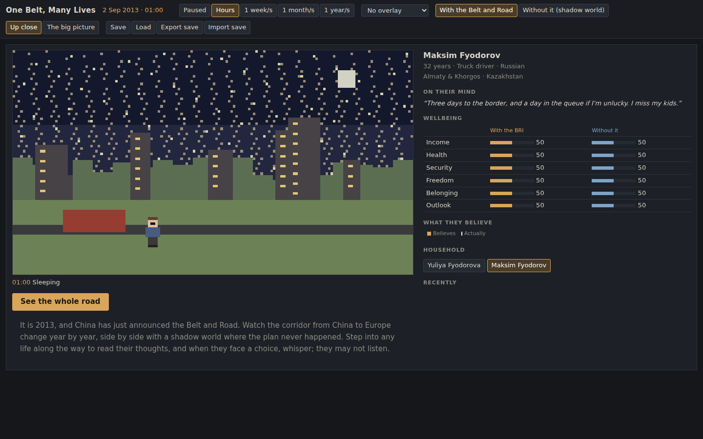
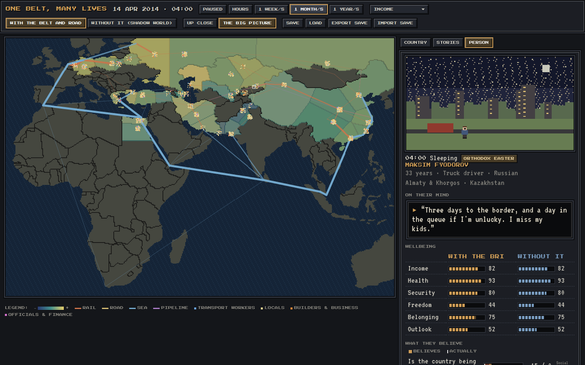
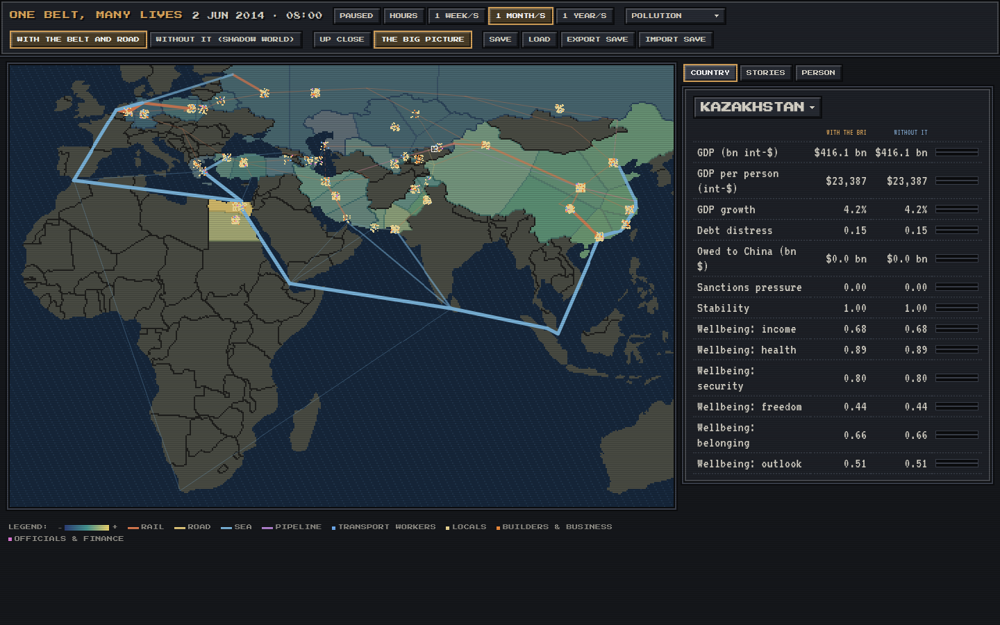

# One Belt, Many Lives

An explorable simulation of the modern Belt and Road Initiative (BRI), from the September 2013
Astana speech into an open-ended future. Watch trade, debt, jobs, pollution and politics unfold
across the corridors from China to Europe, then step into a single life and read their mind:
what they believe, where they heard it, and how far that is from the truth.

Every run simulates **two worlds side by side**: one with the Belt and Road and a _shadow world_
where it never happened. Every chart and every person can be compared with their twin, so you can
see who benefits and who pays.





## Play

- You start **up close**, inside one life, in hours. Press **See the whole road** to zoom out.
- Run time at 1 week, 1 month or 1 year per second. Choose an **overlay** (income, pollution,
  unemployment, feelings about China, wellbeing, debt) and flip between **with** and **without**
  the Belt and Road.
- Click a country for its figures, a dot to follow a person, or a line in **Stories**.
- When someone faces a turning point (a job offer, relocation, a protest, emigration, a bribe,
  speaking out) you can **whisper** an option. They weigh it against their beliefs and
  character, and may refuse. Your whisper is mirrored to their twin in the shadow world.
- Autosaves in the browser; export and import save files.

## What is simulated

- **13 corridor countries and 7 external powers**, 41 regions, 27 cultures, a 72-node rail, road,
  sea and pipeline network, 21 flagship projects and 60 dated historical events (2013–2025).
- **Macro:** historical timeline, project lifecycles, GDP anchored to history (with the BRI's
  estimated contribution removed in the shadow world), loans and debt distress, freight routing
  with sanctions and chokepoints, labour and migration, pollution, land, security and sentiment.
- **People:** about 2,000 per world in households, with births, marriages, jobs, migration,
  displacement and death; six-part wellbeing (income, health, security, freedom, belonging,
  outlook).
- **Minds:** beliefs formed from state media, independent media, social media, word of mouth,
  employers and their own eyes, each with its own spin, noise and reach, and decisions made on
  what people _believe_, not on what is true.
- **Calibration:** the model reproduces the broad shape of history: China–Europe rail trains,
  sanctions on Russia and Iran, Pakistani and Egyptian debt stress, China's cleaner air after
  2013 and the 2024 Red Sea diversion around the Cape.

Values carry provenance (`historical`, `estimated`, `simulated`); sources are listed in the
content files and in `data/raw/MANIFEST.json`.

## Develop

```sh
npm install
npm run dev        # play locally
npm test           # unit tests (< 2 s)
npm run calibrate  # 2013–2024 history checks
npm run verify     # format, lint, types, 100% logic coverage, calibration, build
npm run data       # regenerate content from data/raw
```

Strict red → green → blue TDD with 100% coverage of logic; the view only draws view-models.
See [`CLAUDE.md`](CLAUDE.md), [`docs/DESIGN.md`](docs/DESIGN.md) and
[`docs/ROADMAP.md`](docs/ROADMAP.md).

Code: MIT. Curated data and text: CC BY 4.0 ([`LICENSE-DATA.md`](LICENSE-DATA.md)). Raw datasets
keep their own licenses.
